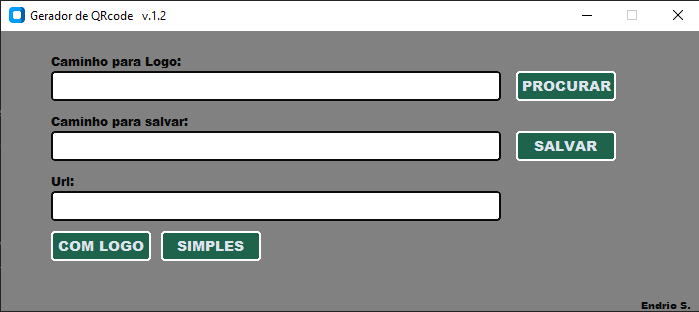

<div align="center">

# 🔳 Gerador de QRCode Offline

<p>
<strong>Gere QR Codes diretamente no seu computador, sem depender da internet.</strong>
</p>



<br><br>


</div>

---

# 📖 Sobre o Projeto

O **Gerador de QRCode Offline** foi desenvolvido para criar QR Codes de forma simples, rápida e totalmente local.

Todo o processamento acontece no próprio computador, garantindo mais **privacidade**, **velocidade** e funcionamento mesmo sem conexão com a internet.

A ferramenta possui uma interface gráfica intuitiva e permite gerar QR Codes:

✅ Simples

✅ Com logotipo personalizado

✅ Offline

---

# ✨ Funcionalidades

- 🔳 Gerar QR Code tradicional
- 🖼️ Inserir um logotipo no centro do QR Code
- 💾 Escolher onde salvar a imagem gerada
- 🌐 Funciona totalmente offline
- ⚡ Interface simples e rápida

---

# 🖥️ Interface

<div align="center">


</div>

---

# 📂 Estrutura do Projeto

```text
GeradorQRCode/
│
├── main.py
├── requirements.txt
├── README.md
```

> **Importante:** Todos os arquivos do projeto devem permanecer na mesma pasta para garantir o funcionamento correto.

---

# 🚀 Instalação

## 1️⃣ Clone o repositório

```bash
git clone https://github.com/RUZ4R/XQrcode.git
```

Entre na pasta:

```bash
cd XQrcode

```

---

## 2️⃣ Instale as dependências

```bash
pip install -r requirements.txt
```

---

## 3️⃣ Execute o programa

```bash
python main.py
```

Pronto!

A aplicação será aberta em poucos segundos.

---

# 📝 Como utilizar

### Gerar QR Code simples

1. Informe a URL.
2. Escolha onde salvar.
3. Clique em **SIMPLES**.

---

### Gerar QR Code com logotipo

1. Clique em **PROCURAR**.
2. Escolha a imagem do logotipo.
3. Informe a URL.
4. Escolha onde salvar.
5. Clique em **COM LOGO**.

---

# ⚙️ Requisitos

- Python 3.10 ou superior
- Dependências instaladas pelo `requirements.txt`

---

# 💡 Vantagens

- ✔ Não envia dados para servidores
- ✔ Funciona sem internet
- ✔ Fácil de utilizar
- ✔ Código simples para estudo
- ✔ Ideal para uso pessoal ou empresarial

---

# 📌 Observações

- Mantenha todos os arquivos do projeto na mesma pasta.
- Utilize imagens em boa qualidade para obter melhores resultados ao inserir um logotipo.
- Quanto menor o logotipo, maior será a legibilidade do QR Code.

---

# 🛠️ Tecnologias

- Python
- Tkinter
- Pillow
- qrcode

---

<div align="center">

## ⭐ Gostou do projeto?

Se este projeto foi útil para você, considere deixar uma ⭐ no repositório!

</div>
